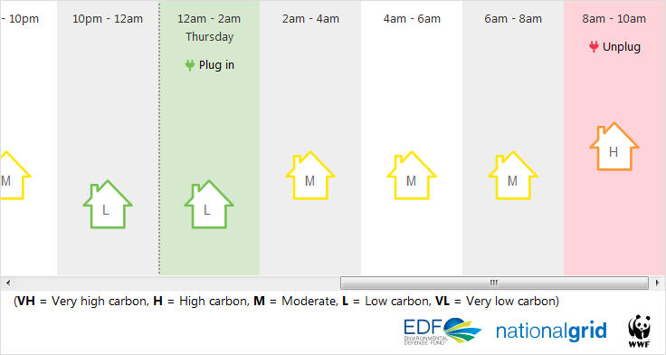

# Carbon Intensity Forecase gizmo



## Use

To add this on your site, use the following snippet:

```html
<iframe class="carbon-gizmo" src="https://carbon-gizmo.wwf.org.uk/1.0.13--beta/" width="100%" height="400px" scrolling="no" style="border:0"></iframe>
```

## Build

To build the tool for deployment on your Amazon S3 bucket, you'll need **Node 8** installed. It has been tested with 8.0.0; recommend either [n](https://github.com/tj/n) or [NVM](https://github.com/creationix/nvm) for switching between different versions of Node.

Clone the repo, then `npm install` or `npm i` to install the dependencies.

Add your S3 credentials to th `.env-example` file, then save as `.env`.

You can optionally add in your [Rollbar](https://rollbar.com) clientside access token; if you leave this out, make sure to comment out the Rollbar snippet in `_views/index.pug`.

`gulp build:pages` compiles the JavaScript and builds the pages into the `build` folder - run a server with this folder at the root to see the gizmo. Both the pages and JavaScript needs to be built for every change, since the compiled JavaScript is versioned with a hash of the file appended to the filename to enable cache-busting.

`gulp publish` copys the built pages to the S3 bucket. This will place it in a versioned folder on your S3 bucket to enable cache-busting rather than invalidating. Any `.html` file will be uploaded with a `Cache-Control` header of `max-age=600`; any non-`.html` file will have a `max-age` of 315360000.